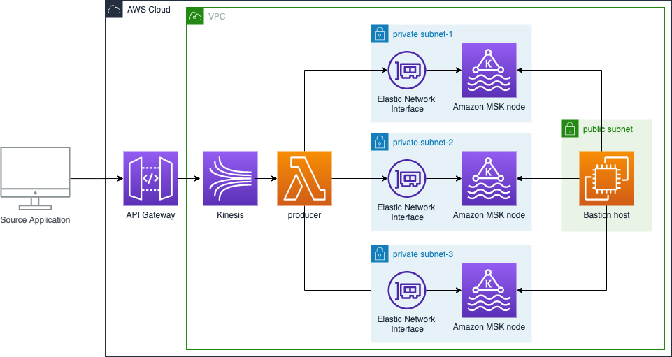

# Apache Kafka publisher CDK Code

This example walks you through how to build a serverless real-time stream producer application using Amazon API Gateway and AWS Lambda. 
For testing, this blog includes a sample AWS Cloud Development Kit (CDK) application. This creates a demo environment, including an Amazon Managed Streaming for Apache Kafka (MSK) cluster and a bastion host for observing the produced messages on the cluster.




This repository will contains the cdk code required to deploy the application.

Configure environment variables

```
export CDK_DEFAULT_ACCOUNT=$(aws sts get-caller-identity --query 'Account' --output text)
export CDK_DEFAULT_REGION=$(aws configure get region)
```

Create a python virtual environment

```
$ python3 -m venv .venv
```

After the init process completes and the virtualenv is created, you can use the following
step to activate your virtualenv.

```
$ source .venv/bin/activate
```

Install cdk requirements
```
$ pip3 install -r requirements.txt
```

Bootstrap your account for CDK usage
```
$ cdk bootstrap aws://$CDK_DEFAULT_ACCOUNT/$CDK_DEFAULT_REGION
```
Run cdk synth to build code and test requirements
```
$ cdk synth
```
Run ‘cdk deploy’ to deploy the code to your AWS account
```
$ cdk deploy --all
```

Testing the example

To test the example, we will log into the bastion host and start a consumer console, which we can use to observe the messages being added to the topic. Then we will generate messages for the Kafka topics by sending calls through the API Gateway from our development machine or AWS Cloud9 environment.

Use AWS System Manager to log into the bastion host. Use the KafkaDemoBackendStack.bastionhostbastion Output-Parameter to connect.
```
aws ssm start-session --target <Bastion Host Instance Id> 
sudo su ec2-user
cd /home/ec2-user/kafka_2.13-2.6.3/bin/
```

Create a topic named messages on the MSK cluster:
```
./kafka-topics.sh --bootstrap-server $ZK --command-config client.properties --create --replication-factor 3 --partitions 3 --topic messages
```

Open a Kafka consumer console on the bastion host to observe incoming messages:
```
./kafka-console-consumer.sh --bootstrap-server $ZK --topic messages --consumer.config client.properties
```

Open another terminal on your development machine to create test requests using the “ServerlessKafkaProducerStack.kafkaproxyapiEndpoint” output parameter of the CDK stack. Use curl to send the API request: 
```
curl -X POST -d “Hello World” <ServerlessKafkaProducerStack.messagesapiendpointEndpoint>
```

For load testing the application, which is important to calibrate the parameters, you can go with a tool like Artillery to simulate workloads. You can find a sample artillery script in the /load-testing folder you previously checked out in step 1.
Observe the incoming request in the bastion host terminal.

Cleaning up
Within the subdirectory “serverless-kafka-iac”, delete the test infrastructure:
```
cdk destroy –all 
```


## Useful commands

 * `cdk ls`          list all stacks in the app
 * `cdk synth`       emits the synthesized CloudFormation template
 * `cdk deploy`      deploy this stack to your default AWS account/region
 * `cdk diff`        compare deployed stack with current state
 * `cdk docs`        open CDK documentation

Enjoy!
